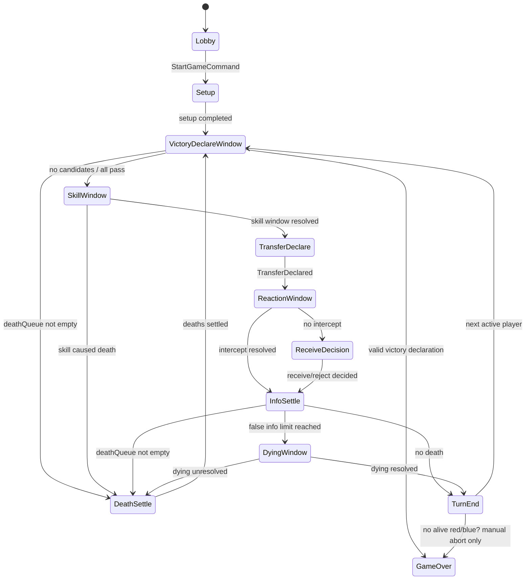

# 《无间风云》MVP 阶段 FSM 与事件队列设计

> 任务：设计游戏阶段流转、技能窗口、事件队列、待响应动作和结算优先级。  
> 前置输入：`outputs/mvp_rule_checklist.md`、`outputs/server_domain_model_design.md`。  
> 目标：为后续 TypeScript WebSocket MVP 骨架中的 `fsm.ts`、`event-bus.ts`、`reducer.ts`、`pending-action.ts` 提供可直接实现的流程算法。

---

## 1. 设计目标与约束

### 1.1 必须覆盖的规则点

- 房主开始游戏后进入固定座位轮转。
- 每名玩家回合包含：技能阶段前宣胜窗口 → 技能阶段 → 传递 → 响应 → 接收/拒收 → 情报结算 → 濒死/死亡 → 下一次宣胜窗口。
- 每次情报传递前后都有技能阶段，但 Milestone 1 可先把“传递后技能阶段”简化为结算后回到下一名玩家的“技能阶段前宣胜窗口”。
- 常规技能：试探、锁定、截获。
- 截获优先于锁定。
- 假情报达到上限进入濒死窗口；无人解除则死亡。
- 死亡结算必须优先于胜利。
- 红/蓝三真、清场只在宣胜窗口确认胜利。
- 多人响应、技能窗口结束条件必须可配置，默认采用确定性策略。

### 1.2 MVP 默认策略

```ts
const defaultMvpFlowPolicy = {
  responsePriorityPolicy: 'seatOrderFromActivePlayer',
  skillWindowPolicy: 'allEligiblePlayersPassOrAct',
  victoryWindowPolicy: 'eligiblePlayersDeclareOrPass',
  deathBeforeVictory: true,
  interceptBeforeLock: true,
  revealInfoAfterSettle: true,
} as const;
```

默认说明：

1. **多人响应优先级**：从当前回合玩家的下一座开始按座位顺序排序；若当前回合玩家也可响应某窗口，则放在其座位自然顺序位置。
2. **技能窗口关闭**：所有有资格的玩家都提交 `act/pass` 后关闭。后续可替换为倒计时或主动结束。
3. **胜利确认**：只在 `VictoryDeclareWindow` 接受 `DeclareVictory`。
4. **死亡优先**：只要 `deathQueue` 非空或存在 `aliveState='dying'`，不得进入 `GameOver`。
5. **截获优先**：响应窗口关闭后先选截获成功者，再处理锁定。

---

## 2. 阶段状态机总览

### 2.1 主 FSM



### 2.2 阶段含义

| 阶段 | 触发 | 主要 pending action | 退出条件 |
|---|---|---|---|
| `Lobby` | 房间创建后 | 无 | 房主开始游戏 |
| `Setup` | `StartGame` | 无 | 身份/角色/资源初始化完成 |
| `VictoryDeclareWindow` | 每次技能阶段前、死亡后 | `victoryDeclareWindow` | 有效宣胜 / 全部跳过 / 无候选 |
| `SkillWindow` | 宣胜窗口后 | `regularSkillWindow`、后续人物技能窗口 | 全部响应完 / 技能导致死亡 |
| `TransferDeclare` | 技能窗口关闭后 | 当前玩家传递动作 | 成功声明传递 |
| `ReactionWindow` | 传递声明后 | 锁定/截获/人物反应 | 响应窗口关闭 |
| `ReceiveDecision` | 无截获且未被强制接收 | `receiveDecision` | 接收者选择接收/拒收 |
| `InfoSettle` | 截获或接收决策后 | 无，系统自动结算 | 情报归属、公开、死亡检查完成 |
| `DyingWindow` | 假情报达到上限 | `dyingSkillWindow` | 濒死解除或进入死亡 |
| `DeathSettle` | 死亡候选存在 | 无，系统自动结算 | 死亡队列清空 |
| `TurnEnd` | 本次传递完整结算后 | 无 | 推进到下一名存活玩家 |
| `GameOver` | 有效胜利确认 | 无 | 终局 |

---

## 3. 事件队列分层

### 3.1 三层队列

建议服务端内部使用三层队列，避免玩家命令、领域事件、结算副作用混杂：

```ts
interface RoomRuntimeQueues {
  /** 外部输入：客户端玩家命令，单房间串行处理。 */
  commandQueue: PlayerCommand[];
  /** 已决策事实：必须进入日志并由 reducer 应用。 */
  eventQueue: EventEnvelope[];
  /** 系统补充结算：由事件触发，仍最终转成 GameEvent。 */
  settlementQueue: SettlementJob[];
}

type SettlementJob =
  | { type: 'dispatchEventHooks'; eventId: EventId }
  | { type: 'resolvePendingAction'; pendingActionId: PendingActionId }
  | { type: 'settleTransfer'; transferId: string }
  | { type: 'checkDying'; playerId: PlayerId; cause: DeathCause }
  | { type: 'settleDeathQueue' }
  | { type: 'checkVictoryCandidates' }
  | { type: 'advancePhase' };
```

### 3.2 队列处理原则

1. `commandQueue` 只收玩家/系统命令，不直接改状态。
2. `eventQueue` 是唯一可持久化、可回放的事实序列。
3. `settlementQueue` 是运行时推导队列，不必持久化；但它产生的结果必须转成事件。
4. 每应用一个事件后立即触发 `dispatchEventHooks`，让技能、死亡、胜利检查器产生后续事件或 pending action。
5. 所有 settlement job 必须在处理下一条玩家命令前清空，除非当前阶段正在等待 pending action。

---

## 4. 主处理循环

### 4.1 命令处理伪代码

```ts
function handleCommand(state: GameState, command: PlayerCommand): DomainResult<GameState> {
  assertRoomQueueIsSerial();

  const validation = validateCommandByPhaseAndPendingAction(state, command);
  if (!validation.ok) return validation;

  const events = decideEventsFromCommand(state, command);
  if (!events.ok) return events;

  let next = appendApplyAndDispatch(state, events.value, command.commandId);
  next = drainSettlementQueue(next);

  return { ok: true, value: next };
}
```

### 4.2 事件应用与派发

```ts
function appendApplyAndDispatch(
  state: GameState,
  events: GameEvent[],
  causedByCommandId?: CommandId,
): GameState {
  let next = state;

  for (const event of events) {
    const envelope = wrapEvent(event, next.version, causedByCommandId);
    next.eventQueue.push(envelope);
    next = applyEvent(next, envelope);
    next.version += 1;

    next.runtime.settlementQueue.push({
      type: 'dispatchEventHooks',
      eventId: envelope.eventId,
    });
  }

  return next;
}
```

### 4.3 结算队列 drain 规则

```ts
function drainSettlementQueue(state: GameState): GameState {
  let next = state;

  while (next.runtime.settlementQueue.length > 0) {
    if (hasOpenBlockingPendingAction(next)) break;

    const job = next.runtime.settlementQueue.shift()!;
    next = runSettlementJob(next, job);
  }

  return next;
}
```

阻塞型 pending action：

- `victoryDeclareWindow`
- `regularSkillWindow`
- `receiveDecision`
- `dyingSkillWindow`
- 后续 `characterSkillWindow`

---

## 5. PendingAction 生命周期

### 5.1 创建

每个窗口都由系统事件或阶段切换创建：

```ts
type PendingActionLifecycle =
  | 'createdByPhaseEnter'
  | 'openForResponses'
  | 'collectActOrPass'
  | 'resolvedToEvents'
  | 'closedAndRemovedOrArchived';
```

建议事件：

```ts
type PendingActionEvent =
  | { type: 'PendingActionOpened'; action: PendingAction }
  | { type: 'PendingActionResponded'; pendingActionId: PendingActionId; response: PendingActionResponse }
  | { type: 'PendingActionResolved'; pendingActionId: PendingActionId; resolution: string }
  | { type: 'PendingActionCancelled'; pendingActionId: PendingActionId; reason: string };
```

> 若不想把 pending action 生命周期放进公开日志，可仍保留为内部事件；但为了回放完整性，建议纳入 `GameEvent`。

### 5.2 响应收集

```ts
function isPendingActionReadyToResolve(state: GameState, action: PendingAction): boolean {
  if (action.status !== 'open') return false;

  if (state.config.skillWindowPolicy === 'allEligiblePlayersPassOrAct') {
    const responded = new Set(action.responses.map(r => r.playerId));
    return action.eligiblePlayerIds.every(id => responded.has(id));
  }

  if (action.requiredPlayerIds?.length) {
    const responded = new Set(action.responses.map(r => r.playerId));
    return action.requiredPlayerIds.every(id => responded.has(id));
  }

  return false;
}
```

### 5.3 取消

出现以下情况必须取消相关 pending action：

- 目标玩家死亡或不再合法。
- 传递被截获后，原接收者的 `receiveDecision` 不再需要。
- 进入 `DeathSettle` 时，非死亡响应窗口全部暂停或取消；MVP 建议取消并由死亡后新阶段重建。
- 游戏进入 `GameOver`。

---

## 6. 关键流程一：开局到首个宣胜窗口

### 6.1 事件链

```text
StartGameCommand
  -> GameStarted
  -> IdentityAssigned * N
  -> CharacterAssigned * N
  -> RegularSkillInitialized * N
  -> PhaseChanged(Lobby/Setup -> VictoryDeclareWindow)
  -> PendingActionOpened(victoryDeclareWindow?) 或 PhaseChanged -> SkillWindow
```

### 6.2 说明

- 开局后先进入 `VictoryDeclareWindow` 是为了保证流程一致，但通常无候选，会自动跳过。
- 若未来角色有开场胜利或开场死亡效果，也可复用同一结算入口。

---

## 7. 关键流程二：宣胜窗口

### 7.1 进入条件

任意阶段准备进入技能阶段前，必须先调用：

```ts
function enterVictoryDeclareWindowOrDeath(state: GameState): GameState {
  if (hasUnsettledDeath(state)) {
    return changePhase(state, 'DeathSettle', { type: 'death', candidates: state.deathQueue });
  }

  const candidates = checkVictoryCandidates(state);
  if (candidates.length === 0) {
    return changePhase(state, 'SkillWindow', activeTurnContext(state));
  }

  return openVictoryDeclarePendingAction(state, candidates);
}
```

### 7.2 候选计算

候选只包含：

- 存活红/蓝玩家。
- 个人真情报数 >= 3 的玩家。
- 或存活玩家只剩同一红/蓝阵营时该阵营存活玩家。

白方任务在 Milestone 1 不启用。

### 7.3 有效宣胜

```text
DeclareVictoryCommand
  -> validate candidate still valid
  -> VictoryDeclared
  -> GameFinished
  -> PhaseChanged(VictoryDeclareWindow -> GameOver)
```

校验要点：

1. 当前阶段必须是 `VictoryDeclareWindow`。
2. 命令玩家必须在候选列表中。
3. 阵营与候选阵营一致。
4. `deathQueue` 为空，且没有 `aliveState='dying'` 的玩家。

### 7.4 全部跳过

```text
PassPendingActionCommand * all candidates
  -> PendingActionResolved(allPass)
  -> PhaseChanged(VictoryDeclareWindow -> SkillWindow)
```

---

## 8. 关键流程三：技能阶段

### 8.1 Milestone 1 技能阶段最小定义

技能阶段开放：

- 当前行动玩家可发起传递前的试探。
- 其他玩家暂不开放任意口头技能，后续人物技能通过 `characterSkillWindow` 加入。
- 若无可用技能或全部 pass，则进入 `TransferDeclare`。

```text
PhaseChanged(... -> SkillWindow)
  -> PendingActionOpened(regularSkillWindow)
  -> ProbeUsed? / pass
  -> PendingActionResolved
  -> PhaseChanged(SkillWindow -> TransferDeclare)
```

### 8.2 试探结算

```text
UseProbeCommand
  -> ProbeUsed
  -> PublicLog(probe announcement)
  -> KnownIdentityUpdated? / MutualKnownEstablished?
```

规则要点：

- 消耗 `probeRemaining`。
- 目标必须存活。
- 若试探颜色等于目标阵营，`matched=true`。
- 若双方同阵营且双方都未达到互知上限，可建立互知。
- 公告只用结构化 key：`probe.successSameFaction`、`probe.successDifferentFaction`、`probe.failed`。
- 试探通常不触发死亡；但仍统一走事件派发，以便后续人物技能监听。

---

## 9. 关键流程四：传递与响应窗口

### 9.1 传递声明

```text
DeclareTransferCommand
  -> validate active player and target alive
  -> TransferDeclared(currentTransfer)
  -> PhaseChanged(TransferDeclare -> ReactionWindow)
  -> PendingActionOpened(regularSkillWindow: lock/intercept)
```

校验：

- 当前阶段必须为 `TransferDeclare`。
- 命令玩家必须是当前回合玩家。
- 传递目标必须是其他存活玩家。
- `truth` 为 `true | false`。

### 9.2 锁定响应

```text
UseLockCommand
  -> validate lockRemaining > 0
  -> validate target is original receiver
  -> LockUsed
```

效果：

- 消耗锁定次数。
- 记录到 `currentTransfer.lockedByPlayerIds`。
- 多人锁定同一接收者时，MVP 可只允许第一个有效锁定；其余命令拒绝或记录失败。建议 Milestone 1 直接拒绝后续锁定。

### 9.3 截获响应

```text
UseInterceptCommand
  -> validate interceptRemaining > 0
  -> validate target is transfer.fromPlayerId
  -> InterceptUsed(success pending until window resolve)
```

注意：窗口未关闭前不立即判定唯一成功者，以支持多人同时提交后的统一排序。

### 9.4 响应窗口关闭后的解析

```ts
function resolveReactionWindow(state: GameState, action: PendingAction): GameEvent[] {
  const interceptCommands = collectInterceptResponses(action);
  const lockCommands = collectLockResponses(action);

  const winnerIntercept = pickFirstByPriority(interceptCommands, state.config.responsePriorityPolicy);

  const events: GameEvent[] = [];

  for (const cmd of interceptCommands) {
    events.push({
      type: 'InterceptUsed',
      sourcePlayerId: cmd.playerId,
      transferId: cmd.transferId,
      targetPlayerId: cmd.targetPlayerId,
      success: cmd === winnerIntercept,
    });
  }

  for (const cmd of lockCommands) {
    events.push({
      type: 'LockUsed',
      sourcePlayerId: cmd.playerId,
      transferId: cmd.transferId,
      targetPlayerId: cmd.targetPlayerId,
    });
  }

  if (winnerIntercept) {
    events.push({
      type: 'TransferReactionResolved',
      transferId: winnerIntercept.transferId,
      result: 'intercepted',
      finalReceiverPlayerId: winnerIntercept.playerId,
    });
  } else if (lockCommands.length > 0) {
    events.push({
      type: 'TransferReactionResolved',
      transferId: lockCommands[0].transferId,
      result: 'locked',
      forcedReceive: true,
    });
  } else {
    events.push({
      type: 'TransferReactionResolved',
      transferId: action.context.transferId,
      result: 'none',
    });
  }

  return events;
}
```

### 9.5 截获优先于锁定

结论规则：

| 响应结果 | 下一阶段 | 最终获得者 |
|---|---|---|
| 有成功截获 | `InfoSettle` | 截获者 |
| 无截获，有锁定 | `InfoSettle` | 原接收者，强制接收 |
| 无截获，无锁定 | `ReceiveDecision` | 等待接收者选择 |

---

## 10. 关键流程五：接收/拒收

### 10.1 接收决策窗口

只在无截获且未被锁定时创建：

```text
PhaseChanged(ReactionWindow -> ReceiveDecision)
  -> PendingActionOpened(receiveDecision, requiredPlayerIds=[target])
```

### 10.2 决策事件

```text
ReceiveInfoCommand(decision='receive')
  -> ReceiveDecisionMade
  -> TransferReactionResolved(finalReceiver=target)
  -> PhaseChanged(ReceiveDecision -> InfoSettle)

ReceiveInfoCommand(decision='reject')
  -> ReceiveDecisionMade
  -> TransferReactionResolved(finalReceiver=from)
  -> PhaseChanged(ReceiveDecision -> InfoSettle)
```

---

## 11. 关键流程六：情报结算

### 11.1 标准事件链

```text
InfoSettle
  -> InfoCreated
  -> InfoOwnerChanged(to finalReceiver)
  -> TransferSettled
  -> InfoRevealed
  -> CheckDying(finalReceiver)
  -> PhaseChanged(...)
```

### 11.2 杀人归属写入 DeathCause

```ts
function buildFalseInfoDeathCause(state: GameState, transfer: CurrentTransfer, receiver: PlayerId): DeathCause {
  const isRejectedBackToSender = receiver === transfer.fromPlayerId
    && transfer.receiveDecision === 'reject';

  return {
    kind: 'falseInfoLimit',
    sourcePlayerId: isRejectedBackToSender ? undefined : transfer.fromPlayerId,
    sourceInfoId: transfer.infoId,
  };
}
```

场景：

| 场景 | 最终获得者 | killer/source |
|---|---|---|
| A 传 B，B 接收假情报死亡 | B | A |
| A 传 B，B 拒收，A 死亡 | A | undefined，自杀 |
| C 截获 A 的假情报死亡 | C | A |
| B 被锁定强制接收死亡 | B | A |

### 11.3 结算后去向

```ts
function afterInfoSettle(state: GameState): GameState {
  if (playerReachedFalseInfoLimit(state.finalReceiver)) {
    return changePhase(state, 'DyingWindow', dyingContext);
  }

  if (hasUnsettledDeath(state)) {
    return changePhase(state, 'DeathSettle', deathContext);
  }

  return changePhase(state, 'TurnEnd', activeTurnContext(state));
}
```

---

## 12. 关键流程七：濒死与死亡

### 12.1 濒死开始

```text
CheckDying
  -> DyingStarted
  -> PhaseChanged(InfoSettle -> DyingWindow)
  -> PendingActionOpened(dyingSkillWindow)
```

Milestone 1 没有救援技能时：

- 仍创建 `dyingSkillWindow`，用于验证扩展点。
- 所有人 pass 后进入死亡。
- 可在测试配置中直接 auto-pass。

### 12.2 濒死解除

后续人物技能可产生：

```text
DyingResolved
  -> PendingActionResolved
  -> PhaseChanged(DyingWindow -> TurnEnd)
```

Milestone 1 只保留事件模型，不实现具体解除技能。

### 12.3 死亡结算事件链

```text
DyingWindow resolved without rescue
  -> PlayerDied
  -> IdentityRevealedByDeath
  -> KillRewardGranted? 
  -> PhaseChanged(DeathSettle -> VictoryDeclareWindow)
```

### 12.4 死亡优先胜利的硬规则

以下函数必须作为进入 `GameOver` 前的最终 guard：

```ts
function canFinishGame(state: GameState): boolean {
  return state.deathQueue.length === 0
    && Object.values(state.players).every(p => p.aliveState !== 'dying')
    && !hasOpenPendingActionOfKind(state, 'dyingSkillWindow');
}
```

`DeclareVictoryCommand` 校验也必须调用该 guard。

---

## 13. 回合推进

### 13.1 TurnEnd 算法

```ts
function advanceTurn(state: GameState): GameEvent[] {
  const aliveSeats = getAlivePlayersSortedBySeat(state);
  const nextSeat = findNextAliveSeat(state.turn.activeSeatIndex, aliveSeats);
  const isNewRound = nextSeat <= state.turn.activeSeatIndex;

  const events: GameEvent[] = [];

  if (isNewRound) {
    events.push({
      type: 'RoundInfoCountBroadcast',
      roundNumber: state.turn.roundNumber,
      counts: buildPublicInfoCounts(state),
    });
  }

  events.push({
    type: 'TurnAdvanced',
    roundNumber: isNewRound ? state.turn.roundNumber + 1 : state.turn.roundNumber,
    activeSeatIndex: nextSeat,
  });

  events.push({
    type: 'PhaseChanged',
    from: 'TurnEnd',
    to: 'VictoryDeclareWindow',
    context: { type: 'activeTurn', activePlayerId: playerIdBySeat(nextSeat) },
  });

  return events;
}
```

### 13.2 死亡玩家跳过

- `activeSeatIndex` 指向死亡玩家时，`advanceTurn` 必须继续找下一名存活玩家。
- 死亡玩家不能成为传递、试探、锁定、截获目标。
- 死亡玩家是否还能发动死亡后人物技能留到 Milestone 2/3，通过特殊 `characterSkillWindow` 实现，不污染基础流程。

---

## 14. Reducer 事件应用要点

### 14.1 PhaseChanged

- 更新 `state.phase`。
- 清理与上一阶段绑定且未解决的 pending action。
- 进入新阶段时由 FSM 创建新的 pending action，不建议 reducer 直接创建复杂窗口；保持 reducer 纯粹。

### 14.2 TransferDeclared

- 设置 `state.currentTransfer`。
- 暂不创建 `InfoCard`，避免传递在响应前就落地。

### 14.3 LockUsed / InterceptUsed

- 扣减对应技能次数。
- 记录到 `currentTransfer`。
- `InterceptUsed(success=false)` 也应扣次数，因为玩家确实发动过。

### 14.4 TransferSettled

- 写入 `finalReceiverPlayerId`、`settled=true`。
- 清空或归档 `currentTransfer` 的时机建议放在离开 `InfoSettle` 时，方便死亡归因读取。

### 14.5 InfoCreated / InfoOwnerChanged / InfoRevealed

- `InfoCreated` 建立卡牌。
- `InfoOwnerChanged` 更新玩家 `infoIds`。
- `InfoRevealed` 设置 `public=true` 并写公开日志。

### 14.6 PlayerDied

- 设置 `aliveState='dead'`。
- 取消该玩家相关普通 pending action。
- 若该玩家正是当前回合玩家，死亡结算后进入 `TurnEnd` 或由 `VictoryDeclareWindow` 前置检查后再推进。

---

## 15. EventBus 派发顺序

每个事件应用后按固定顺序派发检查器：

```text
1. SkillEngine passive/forced triggers
2. DeathEngine check dying/death side effects
3. WinEngine collect candidates only
4. FsmEngine propose phase advance
```

说明：

- `WinEngine` 只生成 `VictoryCandidateFound` 或更新候选，不直接 `GameFinished`。
- 只有玩家在 `VictoryDeclareWindow` 提交有效 `DeclareVictoryCommand` 才生成 `VictoryDeclared/GameFinished`。
- `DeathEngine` 可生成 `DyingStarted/PlayerDied/KillRewardGranted`，优先级高于胜利。
- `SkillEngine` 若生成死亡相关事件，也必须进入同一死亡队列。

---

## 16. 推荐实现文件映射

| 文件 | 核心导出 | 说明 |
|---|---|---|
| `domain/phase.ts` | `GamePhase`, `PhaseState`, `PhaseTransition` | 阶段类型 |
| `domain/event.ts` | `GameEvent`, `EventEnvelope` | 事件定义 |
| `domain/pending-action.ts` | `PendingAction`, `PendingActionKind` | 响应窗口 |
| `engine/fsm.ts` | `enterPhase`, `advancePhase`, `getNextPhase` | 阶段推进 |
| `engine/event-bus.ts` | `dispatchEvent`, `drainSettlementQueue` | 事件派发与结算 |
| `engine/reducer.ts` | `applyEvent` | 纯状态更新 |
| `engine/pending-action-engine.ts` | `openAction`, `recordResponse`, `resolveAction` | 窗口生命周期 |
| `engine/transfer-engine.ts` | `resolveReactionWindow`, `settleTransfer` | 传递/锁定/截获 |
| `engine/death-engine.ts` | `checkDying`, `settleDeathQueue` | 濒死死亡 |
| `engine/win-engine.ts` | `checkVictoryCandidates`, `validateVictoryDeclaration` | 宣胜资格 |

---

## 17. 测试用例设计

### 17.1 FSM 基础

1. `StartGame` 后进入 `VictoryDeclareWindow`，无候选自动进入 `SkillWindow`。
2. `SkillWindow` 全部 pass 后进入 `TransferDeclare`。
3. 当前玩家传递后进入 `ReactionWindow`。
4. 无锁定/截获时进入 `ReceiveDecision`。
5. 接收/拒收后进入 `InfoSettle`，再进入 `TurnEnd`。

### 17.2 常规技能优先级

1. A 传 B，A/B 以外 C 截获，B 被锁定，最终 C 获得情报。
2. A 传 B，无截获，有锁定，B 强制接收。
3. 多人截获同一传递者，按座位顺序只成功一个，其余 `success=false`。
4. 传递者和原接收者不能截获该情报。

### 17.3 死亡优先胜利

1. B 已有 2 真 1 假，A 传 B 假情报使 B 同时达到 3 真候选不变但死亡，必须先死亡，B 不能宣胜。
2. A 传 B 假情报导致 B 死亡，死亡后只剩红方，先 `PlayerDied/IdentityRevealedByDeath/KillRewardGranted`，再开放清场宣胜。
3. A 传 B 假情报，B 拒收导致 A 自杀，不发杀人奖励。
4. 死亡队列非空时 `DeclareVictoryCommand` 被拒绝。

### 17.4 宣胜窗口

1. 玩家获得 3 真后不立刻结束游戏，只生成候选并等待下一次 `VictoryDeclareWindow`。
2. 候选玩家 pass 后继续游戏。
3. 候选玩家宣胜时若仍满足条件，则 `GameFinished`。
4. 白方玩家即使有 3 真，Milestone 1 不生成红/蓝宣胜候选。

---

## 18. 仍需产品确认的问题

1. **技能阶段是否允许非当前玩家主动试探**：当前设计默认仅当前行动玩家在技能阶段可主动试探，减少并发复杂度；若规则要求所有人可随时试探，可改成全员 eligible。
2. **多人响应优先级最终选择**：当前建议默认座位顺序，便于测试；如果更追求“抢先宣告”，可切换为 `serverReceiveOrder`。
3. **技能阶段结束方式**：当前建议全员 pass/act；正式线上可加倒计时，但测试环境仍保留手动推进。
4. **传递后是否需要独立技能阶段**：规则上“传递前后都有技能阶段”，MVP 可先在情报结算后进入下一名玩家的宣胜/技能阶段；若角色技能需要“传递后、换人前”的窗口，后续添加 `PostTransferSkillWindow`。

---

## 19. 结论

本设计将《无间风云》MVP 的阶段推进固化为：

```text
命令 -> 事件 -> reducer 改状态 -> event bus 触发技能/死亡/胜利候选 -> settlement queue 推进阶段 -> pending action 等待玩家响应
```

关键实现原则：

- 玩家命令永远不直接修改状态。
- 所有事实都必须落为事件，便于日志、回放和测试。
- PendingAction 是所有技能/宣胜/接收/濒死窗口的统一抽象。
- 截获解析永远早于锁定解析。
- 死亡队列永远早于胜利确认。
- 胜利只在宣胜窗口由玩家确认，不由 WinEngine 自动结束。

该方案可直接作为后续“搭建 TypeScript WebSocket MVP 项目骨架”和“实现房间与身份分配原型”的 FSM/事件队列实现依据。
