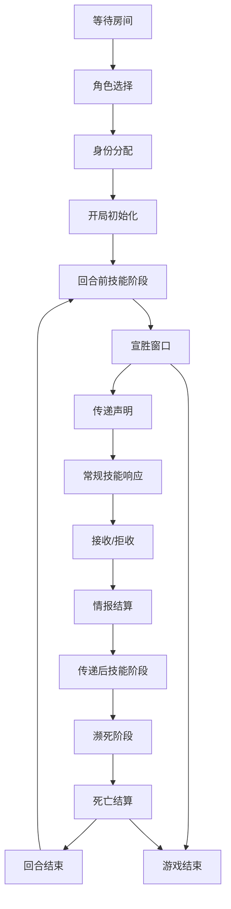

# 无间风云 TypeScript + Web MVP 规则清单与范围边界

## 1. MVP 技术路线确认

本项目第一版采用“更快能玩的 Web MVP”路线：

- 前端：React + TypeScript
- 后端：Node.js + TypeScript
- 通信：WebSocket
- 协议：JSON
- 架构重点：房间单线程队列 + 阶段 FSM + 事件队列 + 技能引擎

目标不是一次性复刻全部 100 个角色，而是先实现可联机游玩的基础人物版。

---

## 2. MVP 玩家规模

第一版支持 4-8 人局。

| 总人数 | 红方 | 蓝方 | 白方 |
|---:|---:|---:|---:|
| 4 | 2 | 2 | 0 |
| 5 | 2 | 2 | 1 |
| 6 | 2 | 2 | 2 |
| 7 | 3 | 3 | 1 |
| 8 | 3 | 3 | 2 |

9-10 人局暂缓，后续再加入“冗余抽选”。

---

## 3. MVP 房间系统

### 必做

- 创建房间
- 加入房间
- 玩家准备/取消准备
- 房主开始游戏
- 座位顺序固定
- 房间日志广播
- 房间内 WebSocket 消息广播

### 暂缓

- 断线重连
- 观战
- GM 后台
- 录像回放
- 机器人玩家

---

## 4. MVP 身份系统

### 必做

- 红方、蓝方、白方身份分配
- 身份暗置
- 玩家只能看到自己的身份
- 死亡后翻开身份
- 白方各自为营，不共享胜利

### 暂缓

- 白方复杂机密任务全量判定
- 身份替换、身份交换、身份反制类复杂技能

---

## 5. MVP 角色范围

首批只实现 10 个基础人物：

| 编号 | 角色 | 类型 | 第一版处理原则 |
|---:|---|---|---|
| 001 | 陈永仁 | 隐藏 / 防御 | 实现城府、就计核心效果，机密任务预留 |
| 002 | 刘建明 | 隐藏 / 辅助 | 实现城府、灭迹，机密任务预留 |
| 004 | 福尔摩斯 | 公开 / 情报 | 实现真相、揭露 |
| 006 | 成步堂龙一 | 公开 / 防御 | 实现异议、逆转 |
| 008 | 开膛手杰克 | 公开 / 杀人 | 实现昭彰、惯犯 |
| 009 | 秋濑或 | 公开 / 情报 | 实现探究、赌博 |
| 014 | 绫里千寻 | 公开 / 辅助 | 实现辩护，灵媒简化或后置 |
| 016 | C.C | 公开 / 辅助 | 实现契约、守护 |
| 017 | 绫波丽 | 公开 / 防御 | 实现冰山、克隆 |
| 020 | 我妻由乃 | 公开 / 防御 | 实现崩坏、新生 |

### 暂缓角色

- 012 基德：替身机制复杂
- 013 狛枝凪斗：死后技能阶段次数复杂
- 018 江之岛盾子：绝望状态和宣胜失败反制复杂
- 019 顾晓梦：遗志、多回合任务判定复杂
- 其余 026-100 全部暂缓

---

## 6. MVP 情报系统

### 数据类型

情报只有两类：

- 真情报 TRUE
- 假情报 FALSE

### 必做规则

- 当前回合玩家指定一名玩家传递一张真/假情报
- 公布传递对象，不公开真假
- 若无人截获或改写，则目标选择接收/拒收
- 接收：目标获得该情报
- 拒收：传递者获得该情报
- 结算后公布情报真假和归属
- 情报归属变化进入事件日志

### 暂缓

- 多层随机情报池
- 密函、陷阱、延时情报
- 情报私存、胃、标记式情报

---

## 7. MVP 常规技能

### 7.1 试探

每名玩家初始 1 次试探机会。每次杀死人奖励 1 次试探。

流程：

1. 发起者选择目标玩家和猜测阵营：RED / BLUE / WHITE。
2. 计算目标的“有效阵营”。
3. 若猜中：
   - 发起者若也属于该阵营，可选择是否互知；
   - 发起者不属于该阵营，系统公告“其实我是卧底”；
4. 若猜错：系统公告“我是一个好人”。

MVP 特别规则：

- 每名玩家最多与一名玩家互知。
- 两个白方默认不视为同阵营。
- 城府角色被试探时，有效阵营视为试探者阵营。

### 7.2 锁定

每名玩家初始 1 次锁定。

效果：

- 锁定情报接收者。
- 被锁定者必须接收情报，不能拒收。

限制：

- 不能锁定自己。
- 每回合针对同一传递最多结算一次锁定。
- 优先级低于截获。

### 7.3 截获

每名玩家初始 1 次截获。

效果：

- 截获某玩家传递中的情报。
- 截获成功后，截获者获得该情报。

限制：

- 传递者不能截获自己的情报。
- 原接收者不能截获该情报。
- 每回合针对同一传递最多结算一次截获。
- 截获优先级高于锁定。

---

## 8. MVP 阶段流程

第一版采用服务端 FSM 管控阶段：



核心原则：

- 技能阶段不是单个函数，而是可追加事件窗口。
- 玩家宣告在先者优先结算。
- 死亡优先于胜利。
- 宣胜窗口放在技能阶段开始前。

---

## 9. MVP 濒死与死亡

### 必做

- 普通角色假情报上限 = 2
- 假情报达到上限进入濒死阶段
- 濒死阶段允许发动可用技能
- 若无法解除濒死，角色死亡
- 死亡后翻开身份牌
- 死亡后不再参与传递和响应
- 传假情报造成他人死亡，视为杀人
- 杀人者获得 1 次额外试探

### 暂缓

- 离场和死亡的复杂差异
- 死亡后技能全量处理
- 多人同时死亡的复杂技能插入

---

## 10. MVP 胜利规则

### 红/蓝阵营

满足任一条件可在宣胜窗口宣告胜利：

1. 任意本方玩家拥有 3 张真情报；
2. 场上只剩本方存活玩家。

### 白方

第一版保留白方任务系统接口，但不优先实现所有机密任务。

MVP 可先支持：

- 手动 GM/测试模式宣告白方任务完成；
- 或仅实现首批 10 个角色中可自动判定的简单任务；
- 后续 Milestone 3 专门补完白方机密任务。

### 全局原则

- 若同时触发死亡和胜利，先结算死亡。
- 若死亡结算后胜利条件仍成立，再进入宣胜窗口。

### 暂缓

- 白方最终 PK
- PK 后累计传递 10 张情报判白方胜利
- 宣胜失败反制
- 共同胜利、单独胜利覆盖阵营胜利

---

## 11. MVP 服务端核心模型

### GameRoom

```ts
interface GameRoom {
  id: string
  status: 'WAITING' | 'SELECTING_ROLE' | 'PLAYING' | 'FINISHED'
  players: Player[]
  hostPlayerId: string
  round: number
  turnIndex: number
  phase: GamePhase
  eventQueue: GameEvent[]
  pendingActions: PendingAction[]
  log: GameLogEntry[]
}
```

### Player

```ts
interface Player {
  id: string
  name: string
  seat: number
  connected: boolean
  alive: boolean
  faction?: Faction
  identityRevealed: boolean
  characterId?: string
  characterFaceUp: boolean
  trueInfos: InfoCard[]
  falseInfos: InfoCard[]
  probeCount: number
  lockCount: number
  interceptCount: number
  knownPlayerIds: string[]
  states: PlayerState[]
  marks: Record<string, number>
}
```

### InfoCard

```ts
interface InfoCard {
  id: string
  type: 'TRUE' | 'FALSE'
  sourcePlayerId?: string
  originalSenderId?: string
  currentOwnerId?: string
  publicKnown: boolean
  tags: string[]
}
```

---

## 12. MVP Web UI

第一版只做能玩的最小界面：

- 房间号、玩家列表、座位号
- 自己身份和角色
- 所有玩家存活状态
- 所有玩家真/假情报数量
- 当前回合玩家
- 当前阶段
- 当前待响应动作
- 可操作按钮：
  - 开始游戏
  - 选择角色
  - 传递真/假情报
  - 接收/拒收
  - 使用试探
  - 使用锁定
  - 使用截获
  - 发动可用角色技能
  - 宣告胜利
- 公共日志区

暂不做复杂动画和美术表现。

---

## 13. MVP 开发顺序

1. 搭建 monorepo 或双包结构：`server/` + `client/` + `shared/`
2. 定义 shared 类型：Faction、Player、InfoCard、GamePhase、GameEvent、Command
3. 实现 WebSocket 连接和房间广播
4. 实现房间创建、加入、准备、开始
5. 实现身份分配和角色分配
6. 实现阶段 FSM
7. 实现传递、接收、拒收
8. 实现锁定、截获、试探
9. 实现濒死、死亡、杀人奖励
10. 实现红蓝胜利
11. 接入技能引擎和首批 10 个角色
12. 补测试用例和调试界面

---

## 14. 第一版验收标准

MVP 可认为达成，当满足：

- 4-8 名玩家可进入同一 Web 房间；
- 房主可开始游戏；
- 每名玩家获得身份和角色；
- 玩家能按座位轮流传递真/假情报；
- 目标可接收或拒收；
- 锁定和截获能改变传递结算；
- 试探可消耗次数并反馈结果；
- 假情报达到 2 张会进入濒死并死亡；
- 死亡后身份公开；
- 杀人者获得额外试探；
- 红/蓝三真或清场可以宣胜；
- 服务端日志足够复盘一局基础对局。
