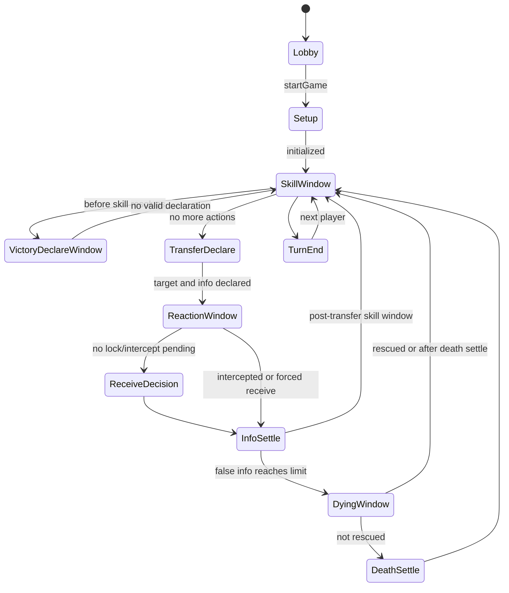

# 《无间风云》基础人物版 MVP 规则清单

> 来源：`outputs/7.2_converted.txt` 规则文档整理。  
> 目标：为第一版“先可玩”的规则引擎、阶段 FSM、事件队列、技能框架提供可执行范围。

## 1. MVP 总体边界

### 1.1 必须实现

- 4-8 人局。
- 红方、蓝方、白方身份分配。
- 身份暗置，死亡后翻身份。
- 角色公开/隐藏、角色牌明置/盖伏的基础状态。
- 真情报 / 假情报。
- 情报传递、接收、拒收、归属变更、公开结算。
- 常规技能：试探、锁定、截获。
- 假情报达到上限进入濒死。
- 濒死技能窗口与死亡结算。
- 杀人奖励额外试探。
- 红/蓝三真宣胜与清场宣胜。
- 宣胜窗口：所有技能阶段开始前。
- 死亡优先于胜利。
- 第一批 10 个基础人物的技能接口预留，Milestone 2 再完整实现。

### 1.2 暂缓实现

- 9 人“冗余抽选”和 10 人局。
- 全 100 个角色。
- 战功系统。
- 白方完整机密任务系统。
- 白方最终 PK 补充奖励。
- 复杂离场、牢狱、绝望、愁伤、星、情、粒、未来等扩展标记系统。
- 替身、化名、复制技能、继承机密任务等高复杂角色机制。
- 私聊法官、玩家自由宣告文本等强人工裁判流程。
- 录像/回放、断线重连、机器人、GM 高级管理。

### 1.3 MVP 实现原则

- 优先用明确 UI 操作替代口头裁判。
- 技能不要硬编码进主流程，应通过事件系统、阶段窗口、响应动作挂接。
- 所有会改变死亡/胜利的效果必须进入统一结算队列。
- “死亡优先于胜利”作为全局结算原则，不允许局部流程绕过。
- 白方第一版只保留身份与占位任务字段，不进行完整任务胜利判定。

---

## 2. 人数与身份规则

### 2.1 必须实现的人数配置

| 总人数 | 红/蓝方人数 | 白方人数 | MVP 状态 |
|---:|---:|---:|---|
| 4 | 2 | 0 | 必须 |
| 5 | 2 | 1 | 必须 |
| 6 | 2 | 2 | 必须 |
| 7 | 3 | 1 | 必须 |
| 8 | 3 | 2 | 必须 |
| 9 | 4 | 2，冗余抽选 | 暂缓 |
| 10 | 4 | 2 | 暂缓 |

> 规则文档表格只明确“红、蓝方”总人数与“白方”人数，MVP 需进一步确定红蓝之间的具体配比。建议：红蓝对称分配；奇数红蓝总人数时由房间配置或随机决定多一方。

### 2.2 身份状态

必须字段：

- `faction`: `red | blue | white`
- `identityRevealed`: 是否明置身份。
- `aliveState`: `alive | dying | dead | left`，MVP 可先只实现 `alive | dying | dead`。
- `deathRevealsIdentity`: 默认死亡后翻身份。

### 2.3 白方处理

MVP：

- 白方作为独立身份参与试探反馈、胜利预留、阵营判断。
- 不实现角色机密任务判定。
- 不实现“白方角色全部死亡可宣胜”。
- 不实现最终 PK 奖励。

后续：

- 按角色/玩家独立任务判定，白方不是统一阵营。

---

## 3. 游戏开始与初始化

### 3.1 必须实现的开局流程

建议 MVP 开局顺序：

1. 房主创建房间。
2. 玩家加入房间并确定座位顺序。
3. 房主开始游戏。
4. 系统分配身份。
5. 系统分配/选择角色。
6. 公布座位与角色信息。
7. 初始化每名玩家资源：
   - 试探次数：1。
   - 锁定次数：1。
   - 截获次数：1。
   - 假情报上限：默认 2。
8. 进入第一个玩家的技能阶段。

### 3.2 暂缓的开局细节

- “获知选择和座位，选角色，获知身份，选游戏开始前选项，对全体发布选人信息后，选开场选项”的复杂角色开局选项。
- 隐藏角色的开场私聊选择。
- 化名、指定对象、预设陷阱等角色专属开局流程。

---

## 4. 阶段与回合规则

### 4.1 MVP 阶段

建议最小 FSM：

### 4.2 一轮游戏

- 从游戏开始到座次最后一位玩家传递阶段结束，为第一轮。
- 末位玩家的技能阶段后进入第二轮。
- 每轮游戏后公布一次情报数。
- MVP 可在每轮结束事件中广播公开情报数。

### 4.3 技能阶段

必须实现：

- 每次情报传递前后都存在技能阶段。
- 技能阶段开始前开放宣胜窗口。
- 后续技能可追加，但 MVP 可用“待响应动作队列”实现顺序结算。
- 被动技能通过事件自动触发。

暂缓：

- 公屏抢先宣告的自由时序。
- 隐藏/延时技能私聊发动。
- 多层追加技能的复杂抢时。

MVP 建议：

- 所有响应动作由服务端生成 `pendingActions`，限定可操作玩家、动作类型、截止策略。
- 第一版不做真实计时，可由所有可响应玩家选择“跳过/发动”后推进。

---

## 5. 情报系统

### 5.1 情报类型

必须字段：

- `infoId`
- `truth`: `true | false`
- `sourcePlayerId`: 原始传递者或技能来源。
- `ownerPlayerId`: 当前归属玩家。
- `public`: 是否公开。
- `createdBy`: `transfer | skill | system`
- `tags`: 预留。

### 5.2 传递基础流程

必须实现：

1. 当前回合玩家选择一名其他存活玩家作为传递对象。
2. 当前回合玩家选择传递真/假情报。
3. 系统广播传递对象，但可先不公开真假。
4. 进入常规技能响应窗口。
5. 若无截获/锁定改变归属，则询问被传递人接收或拒收。
6. 接收：接收者获得情报。
7. 拒收：传递者获得情报。
8. 结算后公布情报详情。
9. 检查濒死、死亡、杀人奖励、胜利窗口。

### 5.3 情报公开

MVP：

- 每次传递结算后公布该情报真假与最终获得者。
- 每轮结束广播每名在场玩家公开可见情报数量。

暂缓：

- 罗辑等角色隐藏结算。
- 密函、陷阱情报、随机情报、附加情报。

---

## 6. 常规技能

## 6.1 试探

### 必须实现

- 每名玩家初始 1 次试探。
- 每次杀死人奖励额外 1 次试探。
- 试探可选择目标玩家和阵营颜色：红/蓝/白。
- 若试探成功：
  - 试探者与目标同阵营时，可选择是否互知。
  - 试探者与目标不同阵营时，公告“其实我是卧底”。
- 若试探失败：公告“我是一个好人”。
- 每名玩家最多与一名玩家互知。

### MVP 简化

- “试探可随时进行”先实现为：可在技能阶段或指定常规技能窗口使用。
- 公告文本可结构化为：`probe.successSameFaction`、`probe.successDifferentFaction`、`probe.failed`。
- 白方之间默认不视为同阵营，不触发普通互知。
- 城府等特殊试探改写效果留给角色技能阶段实现。

### 暂缓

- 白方试探到城府角色可互知。
- 特殊技能突破“一人最多一个互知对象”。
- 隐藏角色被试探失败后获知角色等角色特效。

## 6.2 锁定

### 必须实现

- 每名玩家初始 1 次锁定。
- 锁定对象为情报接收者。
- 被锁定玩家必须接收该情报，不能拒收。
- 锁定对象不能是自己。
- 每回合针对一个玩家的锁定最多结算一次。

### 结算优先级

- 截获优先于锁定。
- 若 A 传给 B，A 锁定，C 截获，则 C 截获成功，B 不再接收。

## 6.3 截获

### 必须实现

- 每名玩家初始 1 次截获。
- 截获对象为情报传递者。
- 截获成功后，截获者获得该情报。
- 传递者和原接收者不能截获该情报。
- 每回合针对一个玩家的截获最多结算一次。
- 截获优先级大于锁定。

### 开放问题

- 多人同时截获同一传递者时的优先规则原文未完全机器化。建议 MVP 使用座位顺序或响应提交顺序，并在 UI 中明确。

---

## 7. 濒死、死亡、杀人

## 7.1 假情报上限

必须实现：

- 默认假情报上限为 2。
- 玩家面前假情报达到上限，进入濒死阶段。
- 濒死阶段结束后若未解除濒死，死亡。

暂缓：

- 角色修改假情报上限。
- 无假情报上限、延迟死亡、离场替代死亡等角色机制。

## 7.2 濒死阶段

必须实现：

- 当有人达到假情报上限，插入濒死窗口。
- 允许濒死阶段技能响应。
- MVP Milestone 1 可先只开放通用“无响应/跳过”，为人物技能预留扩展点。

## 7.3 死亡结算

必须实现：

- 死亡后翻身份牌。
- 死亡玩家不能继续作为普通技能目标。
- 死亡优先于胜利。
- 若一次结算同时触发多个死亡与胜利，先完整处理死亡队列，再检查胜利宣告。

## 7.4 杀人判定

必须实现：

- 传假情报造成对方死亡，传递者为杀人方。
- 使用技能直接导致对方死亡，技能来源为杀人方。
- 传出假情报遭拒绝导致自己死亡，视为自杀。
- 杀死人奖励额外试探。

暂缓：

- 公开更换或追加情报技能导致死亡的精细杀人归属。
- 隐藏技能杀人不视为杀人方。
- 离场不结算杀人。

---

## 8. 胜利与宣胜

## 8.1 红/蓝方胜利

必须实现：

- 任意本方玩家获得 3 张真情报，可在宣胜窗口宣告所在阵营胜利。
- 场上只剩本方玩家时，集体宣告胜利。
- 宣告胜利成功即为获胜。

## 8.2 宣胜窗口

必须实现：

- 宣胜时间点为所有技能阶段开始前的结算点。
- 死亡优先于胜利。
- 技能阶段前检查当前是否有可宣胜玩家。

建议流程：

1. 进入技能阶段前，系统生成 `VictoryDeclareWindow`。
2. 找出满足条件的红/蓝玩家。
3. 允许满足条件的玩家宣胜或跳过。
4. 若有待处理死亡，先处理死亡，再重新计算宣胜资格。

## 8.3 白方胜利

MVP 暂缓完整实现：

- 只保留角色任务字段与宣胜接口。
- 首版不判定白方角色机密任务。
- 不实现“白方角色全部死亡时可宣告胜利”。
- 不实现带 ※ 的死亡/离场后触发胜利。

## 8.4 输掉游戏/离场

暂缓实现：

- “输掉游戏”立刻移出、死亡不公布身份、失去胜利条件。
- 离场与死亡的差异。

---

## 9. 第一批 10 个基础人物范围建议

> Milestone 1 仅需预留角色技能引擎；Milestone 2 实现以下角色。这里按复杂度给出 MVP 建议。

| 编号 | 角色 | MVP 建议 | 备注 |
|---|---|---|---|
| 001 | 陈永仁 | 第二批或简化实现 | 城府、隐技能、返还假情报、白方任务较复杂 |
| 002 | 刘建明 | 第二批或简化实现 | 城府、弃置至多三张情报、宣胜干扰 |
| 004 | 福尔摩斯 | 优先实现 | 真情报奖励试探、揭露传递情报，适合验证事件系统 |
| 006 | 成步堂龙一 | 优先实现 | 禁人物技能、交换情报，适合验证技能目标与情报移动 |
| 008 | 开膛手杰克 | 优先实现 | 性别条件、不能拒绝、杀人后额外假情报 |
| 009 | 秋濑或 | 中等实现 | 试探失败获知隐藏角色、赌博随机真/假 |
| 014 | 绫里千寻 | 中等偏后 | 真/假等量替换、死者代传、死亡后遗言控制 |
| 016 | C.C | 优先实现 | 同时传两份情报、传真后烧假 |
| 017 | 绫波丽 | 优先实现 | 锁定无效、截获时复制情报状态 |
| 020 | 我妻由乃 | 优先实现 | 获假后给假、濒死烧假 |

### 9.1 角色技能框架必须预留的触发点

- `onGameStart`
- `beforeSkillPhase`
- `onSkillPhase`
- `beforeTransferDeclare`
- `onTransferDeclared`
- `onRegularSkillUsed`
- `beforeReceiveDecision`
- `onInfoReceived`
- `afterTransferSettled`
- `onDyingStart`
- `onDeathSettled`
- `onVictoryDeclare`

---

## 10. MVP 必须支持的数据状态

## 10.1 Player

- `playerId`
- `seatIndex`
- `userId`
- `faction`
- `identityRevealed`
- `characterId`
- `characterPublicType`: `public | hidden`
- `characterRevealed`
- `gender`: `male | female | unknown`
- `aliveState`
- `falseInfoLimit`
- `infoIds`
- `probeCount`
- `lockCount`
- `interceptCount`
- `knownPartners`
- `knownIdentities`
- `flags/tags`

## 10.2 GameRoom / Game

- `roomId`
- `players`
- `phase`
- `roundNumber`
- `activeSeatIndex`
- `eventQueue`
- `pendingActions`
- `currentTransfer`
- `discardPile`
- `publicLog`
- `winner`

## 10.3 CurrentTransfer

- `fromPlayerId`
- `targetPlayerId`
- `truth`
- `lockedByPlayerIds`
- `interceptedByPlayerId`
- `finalReceiverPlayerId`
- `forcedReceive`
- `settled`

---

## 11. 开放问题

1. **红蓝具体配比**：规则表仅写“红、蓝方”总数，未明确 5/7/8 人时红蓝各几人。需要产品规则确定。
2. **多人同时响应优先级**：锁定/截获/人物技能多名玩家同时发动时，原文偏向“宣告在先者优先”，线上 MVP 需要确定为座位顺序、提交时间、还是服务端响应队列。
3. **试探公告文案**：原文中“其实我是卧底/我是一个好人”是口头公告，线上应结构化显示，需要确定 UI 文案。
4. **技能阶段结束条件**：是否需要所有玩家逐一点“跳过”，还是房主/系统倒计时推进。MVP 可先用全员确认。
5. **白方任务何时接入**：Milestone 1 暂缓，Milestone 3 需要完整任务 DSL 或代码化判定方案。
6. **情报牌来源**：规则没有给出牌堆数量与随机抽取方式，MVP 可直接由传递者声明真假生成情报；角色随机情报后续再定义牌堆。
7. **公开信息边界**：每轮公布“含在场玩家可以公开的信息”，需进一步明确哪些角色效果会隐藏情报数；MVP 先全公开数量。

---

## 12. Milestone 1 可执行验收清单

- [ ] 可创建 4-8 人房间并加入座位。
- [ ] 可开始游戏并分配红/蓝/白身份。
- [ ] 每名玩家初始化 1 试探、1 锁定、1 截获、假情报上限 2。
- [ ] 可按座位轮流进入技能阶段、传递阶段、结算阶段。
- [ ] 当前玩家可向其他存活玩家传递真/假情报。
- [ ] 接收者可接收或拒收。
- [ ] 锁定可强制接收。
- [ ] 截获可优先于锁定并改变最终获得者。
- [ ] 试探可消耗次数并返回成功/失败公告。
- [ ] 玩家获得第 2 张假情报后进入濒死。
- [ ] 濒死未解除则死亡并翻身份。
- [ ] 传假致死者获得额外试探。
- [ ] 玩家获得 3 张真情报后可在技能阶段前宣胜。
- [ ] 场上只剩同一红/蓝阵营玩家时可宣胜。
- [ ] 同时触发死亡与胜利时先结算死亡。
- [ ] 白方身份存在，但任务胜利暂不生效。
