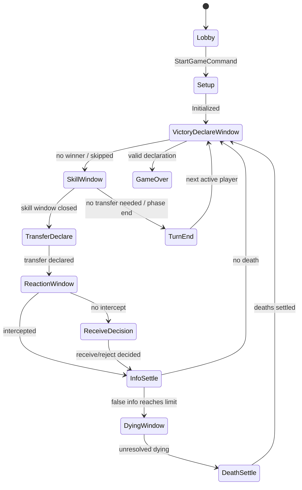

# 《无间风云》MVP 服务端核心领域模型设计

> 任务：设计 `GameRoom`、`Player`、`InfoCard`、`GamePhase`、`GameEvent`、`Skill`、`WinCondition` 等 TypeScript 类型与模块边界。  
> 目标：为 Milestone 1 的核心规则引擎、阶段 FSM、事件队列、常规技能和后续人物技能扩展提供稳定领域模型。

---

## 1. 设计原则

1. **Game 是唯一权威状态**：服务端通过单房间串行队列修改 `GameState`，客户端只提交意图动作。
2. **阶段驱动 + 事件驱动结合**：`GamePhase` 管控主流程，`GameEvent` 记录事实并触发技能/胜负/死亡结算。
3. **技能不写死在流程中**：常规技能和人物技能都实现为 `SkillDefinition`，通过触发点和 pending action 接入。
4. **所有玩家操作必须结构化**：传递、接收、拒收、试探、锁定、截获、宣胜都抽象为 `PlayerCommand`。
5. **死亡优先于胜利**：死亡与胜利都进入统一结算队列，`DeathSettle` 必须先于 `VictoryDeclare` 生效。
6. **为白方任务预留但不启用完整判定**：MVP 保留 `secretMission`、`whiteWinState` 扩展字段，不参与 Milestone 1 胜负。
7. **规则争议集中配置化**：红蓝配比、多响应优先级、技能窗口推进方式放入 `GameConfig`，避免散落在流程代码中。

---

## 2. 推荐目录与模块边界

```text
server/src/
  domain/
    types.ts              # 基础枚举、ID、Result、通用工具类型
    game-state.ts         # GameState / GameRoom / Player / InfoCard
    phase.ts              # GamePhase / PhaseContext / FSM transition 类型
    event.ts              # GameEvent / EventEnvelope / EventQueue
    command.ts            # PlayerCommand / SystemCommand / command validation
    pending-action.ts     # PendingAction / ActionRequirement / response 收集
    skill.ts              # SkillDefinition / TriggerPoint / SkillEffect
    win.ts                # WinCondition / WinCandidate / winner 类型
    config.ts             # GameConfig / 人数身份配置 / 优先级策略
  engine/
    room-queue.ts         # 单房间串行队列，保证同房间命令顺序处理
    reducer.ts            # applyEvent / reduceCommandToEvents
    fsm.ts                # 阶段推进与 transition guard
    event-bus.ts          # 分发事件给技能、胜负、死亡检查
    skill-engine.ts       # 技能注册、触发点匹配、生成 effect / pendingAction
    win-engine.ts         # 三真/清场/白方预留胜利检查
    death-engine.ts       # 濒死、死亡、翻身份、杀人奖励试探
    identity-engine.ts    # 身份分配、红蓝配比策略
    info-engine.ts        # 情报生成、归属、公开、数量统计
  skills/
    regular/
      probe.ts            # 试探
      lock.ts             # 锁定
      intercept.ts        # 截获
    characters/
      index.ts            # 人物技能注册入口，Milestone 2 扩展
  transport/
    protocol.ts           # WS JSON 协议 DTO 与 domain command 映射
```

### 2.1 模块职责

| 模块 | 职责 | 不应负责 |
|---|---|---|
| `domain/*` | 类型、状态结构、事件/命令定义 | 直接执行业务流程 |
| `engine/fsm.ts` | 阶段推进、合法 transition | 人物技能细节 |
| `engine/reducer.ts` | 根据事件纯函数更新 `GameState` | 网络、数据库、随机数生成 |
| `engine/event-bus.ts` | 事件广播给技能/死亡/胜负检查器 | 直接修改状态 |
| `engine/skill-engine.ts` | 技能触发、条件检查、效果转事件 | 硬编码特定阶段主流程 |
| `engine/win-engine.ts` | 胜利资格、宣胜校验 | 死亡结算 |
| `engine/death-engine.ts` | 濒死、死亡、身份翻开、杀人奖励 | 胜利确认 |
| `transport/*` | 外部协议与领域命令转换 | 游戏规则判定 |

---

## 3. 核心 TypeScript 类型草案

### 3.1 基础类型

```ts
export type Brand<T, Name extends string> = T & { readonly __brand: Name };

export type RoomId = Brand<string, 'RoomId'>;
export type UserId = Brand<string, 'UserId'>;
export type PlayerId = Brand<string, 'PlayerId'>;
export type CharacterId = Brand<string, 'CharacterId'>;
export type InfoId = Brand<string, 'InfoId'>;
export type EventId = Brand<string, 'EventId'>;
export type CommandId = Brand<string, 'CommandId'>;
export type PendingActionId = Brand<string, 'PendingActionId'>;

export type Faction = 'red' | 'blue' | 'white';
export type AliveState = 'alive' | 'dying' | 'dead';
export type InfoTruth = 'true' | 'false';
export type Gender = 'male' | 'female' | 'unknown';
export type CharacterVisibility = 'public' | 'hidden';

export interface DomainError {
  code: string;
  message: string;
  details?: Record<string, unknown>;
}

export type DomainResult<T> =
  | { ok: true; value: T }
  | { ok: false; error: DomainError };
```

---

### 3.2 GameConfig

```ts
export interface GameConfig {
  playerCount: 4 | 5 | 6 | 7 | 8;
  identityPolicy: IdentityPolicy;
  responsePriorityPolicy: ResponsePriorityPolicy;
  skillWindowPolicy: SkillWindowPolicy;
  falseInfoLimitDefault: number; // MVP: 2
  initialRegularSkillCounts: RegularSkillCounts; // MVP: 1/1/1
  enableWhiteSecretMission: boolean; // MVP: false
  enableCharacterSkills: boolean; // Milestone 1 可为 false 或只注册空实现
}

export interface IdentityPolicy {
  redBlueTotal: number;
  whiteCount: number;
  redCount?: number;
  blueCount?: number;
  oddRedBlueTieBreaker?: 'random' | 'roomOwnerChoice' | 'configFixed';
}

export type ResponsePriorityPolicy =
  | 'seatOrderFromActivePlayer'
  | 'serverReceiveOrder'
  | 'explicitPriorityQueue';

export type SkillWindowPolicy =
  | 'allEligiblePlayersPassOrAct'
  | 'activePlayerEndsWindow'
  | 'serverTimer';

export interface RegularSkillCounts {
  probe: number;
  lock: number;
  intercept: number;
}
```

> MVP 建议默认：`responsePriorityPolicy = 'seatOrderFromActivePlayer'`，便于确定性测试；如产品更强调实时抢先，可切换为 `serverReceiveOrder`。

---

### 3.3 GameRoom / GameState

```ts
export interface GameRoom {
  roomId: RoomId;
  status: RoomStatus;
  ownerUserId: UserId;
  seats: RoomSeat[];
  game?: GameState;
  createdAt: number;
  updatedAt: number;
}

export type RoomStatus = 'lobby' | 'playing' | 'finished' | 'closed';

export interface RoomSeat {
  seatIndex: number;
  userId: UserId;
  playerId?: PlayerId;
  ready: boolean;
  connected: boolean;
}

export interface GameState {
  roomId: RoomId;
  config: GameConfig;
  status: GameStatus;
  players: Record<PlayerId, Player>;
  turn: TurnState;
  phase: PhaseState;
  infoCards: Record<InfoId, InfoCard>;
  currentTransfer?: CurrentTransfer;
  eventQueue: EventEnvelope[];
  pendingActions: Record<PendingActionId, PendingAction>;
  publicLog: PublicLogEntry[];
  deathQueue: DeathCandidate[];
  winState: WinState;
  rngState: RngState;
  version: number;
}

export type GameStatus = 'setup' | 'running' | 'settling' | 'finished';

export interface TurnState {
  roundNumber: number;
  activeSeatIndex: number;
  turnSerial: number;
}

export interface RngState {
  seed: string;
  drawCount: number;
}
```

---

### 3.4 Player

```ts
export interface Player {
  playerId: PlayerId;
  userId: UserId;
  seatIndex: number;

  faction: Faction;
  identityRevealed: boolean;

  characterId?: CharacterId;
  characterName?: string;
  characterVisibility: CharacterVisibility;
  characterRevealed: boolean;
  gender: Gender;

  aliveState: AliveState;
  falseInfoLimit: number;
  infoIds: InfoId[];

  regularSkills: RegularSkillState;
  knownPartners: PlayerId[];
  knownIdentities: KnownIdentity[];

  secretMission?: SecretMissionState;
  flags: Record<string, boolean | number | string>;
  tags: string[];
}

export interface RegularSkillState {
  probeRemaining: number;
  lockRemaining: number;
  interceptRemaining: number;
  /** 限制每名玩家最多互知一人，角色特效可通过 flags 放宽。 */
  mutualKnownPlayerId?: PlayerId;
}

export interface KnownIdentity {
  targetPlayerId: PlayerId;
  faction?: Faction;
  characterId?: CharacterId;
  source: 'probe' | 'skill' | 'system';
}

export interface SecretMissionState {
  missionId: string;
  enabled: boolean; // MVP: false
  progress?: Record<string, unknown>;
  completed?: boolean;
}
```

---

### 3.5 InfoCard / CurrentTransfer

```ts
export interface InfoCard {
  infoId: InfoId;
  truth: InfoTruth;
  sourcePlayerId?: PlayerId;
  ownerPlayerId: PlayerId;
  public: boolean;
  createdBy: 'transfer' | 'skill' | 'system';
  createdEventId: EventId;
  tags: string[];
  metadata?: Record<string, unknown>;
}

export interface CurrentTransfer {
  transferId: string;
  fromPlayerId: PlayerId;
  targetPlayerId: PlayerId;
  declaredTruth: InfoTruth;
  infoId?: InfoId;

  lockedByPlayerIds: PlayerId[];
  interceptedByPlayerId?: PlayerId;
  finalReceiverPlayerId?: PlayerId;
  forcedReceive: boolean;
  receiveDecision?: ReceiveDecision;
  settled: boolean;
}

export type ReceiveDecision = 'receive' | 'reject';
```

---

## 4. Phase 与 FSM 模型

### 4.1 PhaseState

```ts
export type GamePhase =
  | 'Lobby'
  | 'Setup'
  | 'VictoryDeclareWindow'
  | 'SkillWindow'
  | 'TransferDeclare'
  | 'ReactionWindow'
  | 'ReceiveDecision'
  | 'InfoSettle'
  | 'DyingWindow'
  | 'DeathSettle'
  | 'TurnEnd'
  | 'GameOver';

export interface PhaseState {
  phase: GamePhase;
  enteredAtVersion: number;
  context: PhaseContext;
}

export type PhaseContext =
  | { type: 'none' }
  | { type: 'activeTurn'; activePlayerId: PlayerId }
  | { type: 'transfer'; transferId: string }
  | { type: 'pendingAction'; pendingActionIds: PendingActionId[] }
  | { type: 'dying'; playerId: PlayerId; cause: DeathCause }
  | { type: 'death'; candidates: DeathCandidate[] }
  | { type: 'victory'; candidates: WinCandidate[] };

export interface PhaseTransition {
  from: GamePhase;
  to: GamePhase;
  reason: string;
  guard?: (state: GameState) => boolean;
}
```

### 4.2 MVP 主流程



> 注：宣胜窗口置于技能阶段前；若任意流程产生死亡，先进入 `DeathSettle`，再回到宣胜资格检查。

---

## 5. 命令 PlayerCommand

命令表示“玩家/系统请求做某事”，不直接等价于事实。命令通过校验后产出一个或多个事件。

```ts
export type PlayerCommand =
  | StartGameCommand
  | DeclareTransferCommand
  | ReceiveInfoCommand
  | UseProbeCommand
  | UseLockCommand
  | UseInterceptCommand
  | DeclareVictoryCommand
  | PassPendingActionCommand;

export interface CommandBase {
  commandId: CommandId;
  roomId: RoomId;
  playerId: PlayerId;
  clientSeq?: number;
  createdAt: number;
}

export interface StartGameCommand extends CommandBase {
  type: 'StartGame';
}

export interface DeclareTransferCommand extends CommandBase {
  type: 'DeclareTransfer';
  targetPlayerId: PlayerId;
  truth: InfoTruth;
}

export interface ReceiveInfoCommand extends CommandBase {
  type: 'ReceiveInfo';
  transferId: string;
  decision: ReceiveDecision;
}

export interface UseProbeCommand extends CommandBase {
  type: 'UseProbe';
  targetPlayerId: PlayerId;
  declaredFaction: Faction;
}

export interface UseLockCommand extends CommandBase {
  type: 'UseLock';
  transferId: string;
  targetPlayerId: PlayerId;
}

export interface UseInterceptCommand extends CommandBase {
  type: 'UseIntercept';
  transferId: string;
  targetPlayerId: PlayerId; // 情报传递者
}

export interface DeclareVictoryCommand extends CommandBase {
  type: 'DeclareVictory';
  faction: Extract<Faction, 'red' | 'blue'>;
  reason: 'threeTrueInfo' | 'clearField';
}

export interface PassPendingActionCommand extends CommandBase {
  type: 'PassPendingAction';
  pendingActionId: PendingActionId;
}
```

---

## 6. PendingAction 模型

`PendingAction` 用于把“可响应窗口”显式化，既支持常规技能，也支持后续人物技能。

```ts
export interface PendingAction {
  pendingActionId: PendingActionId;
  kind: PendingActionKind;
  phase: GamePhase;
  eligiblePlayerIds: PlayerId[];
  requiredPlayerIds?: PlayerId[];
  status: PendingActionStatus;
  responses: PendingActionResponse[];
  priorityPolicy: ResponsePriorityPolicy;
  expiresAt?: number;
  context: PendingActionContext;
}

export type PendingActionKind =
  | 'regularSkillWindow'
  | 'receiveDecision'
  | 'dyingSkillWindow'
  | 'victoryDeclareWindow'
  | 'characterSkillWindow';

export type PendingActionStatus = 'open' | 'resolved' | 'cancelled';

export interface PendingActionResponse {
  playerId: PlayerId;
  commandId: CommandId;
  responseType: 'act' | 'pass';
  submittedAt: number;
}

export type PendingActionContext =
  | { type: 'transfer'; transferId: string }
  | { type: 'dying'; playerId: PlayerId }
  | { type: 'victory'; candidates: WinCandidate[] }
  | { type: 'generic'; data?: Record<string, unknown> };
```

---

## 7. GameEvent 模型

事件表示已经发生的事实，是日志、回放、测试和状态还原的基础。

```ts
export interface EventEnvelope<T extends GameEvent = GameEvent> {
  eventId: EventId;
  roomId: RoomId;
  type: T['type'];
  payload: T;
  causedByCommandId?: CommandId;
  causedByEventId?: EventId;
  createdAt: number;
  gameVersionBefore: number;
}

export type GameEvent =
  | RoomEvent
  | SetupEvent
  | PhaseEvent
  | TransferEvent
  | RegularSkillEvent
  | InfoEvent
  | DyingDeathEvent
  | VictoryEvent
  | SkillEvent;
```

### 7.1 关键事件类型

```ts
export type RoomEvent =
  | { type: 'RoomCreated'; roomId: RoomId; ownerUserId: UserId }
  | { type: 'PlayerJoined'; userId: UserId; seatIndex: number; playerId: PlayerId };

export type SetupEvent =
  | { type: 'GameStarted'; config: GameConfig }
  | { type: 'IdentityAssigned'; playerId: PlayerId; faction: Faction }
  | { type: 'CharacterAssigned'; playerId: PlayerId; characterId: CharacterId };

export type PhaseEvent =
  | { type: 'PhaseChanged'; from: GamePhase; to: GamePhase; context: PhaseContext }
  | { type: 'TurnAdvanced'; roundNumber: number; activeSeatIndex: number };

export type TransferEvent =
  | { type: 'TransferDeclared'; transfer: CurrentTransfer }
  | { type: 'ReceiveDecisionMade'; transferId: string; playerId: PlayerId; decision: ReceiveDecision }
  | { type: 'TransferSettled'; transferId: string; finalReceiverPlayerId: PlayerId; infoId: InfoId };

export type RegularSkillEvent =
  | { type: 'ProbeUsed'; sourcePlayerId: PlayerId; targetPlayerId: PlayerId; declaredFaction: Faction; result: ProbeResult }
  | { type: 'LockUsed'; sourcePlayerId: PlayerId; transferId: string; targetPlayerId: PlayerId }
  | { type: 'InterceptUsed'; sourcePlayerId: PlayerId; transferId: string; targetPlayerId: PlayerId; success: boolean };

export interface ProbeResult {
  matched: boolean;
  sameFaction: boolean;
  announcement: 'probe.successSameFaction' | 'probe.successDifferentFaction' | 'probe.failed';
  mutualKnownEstablished?: boolean;
}

export type InfoEvent =
  | { type: 'InfoCreated'; info: InfoCard }
  | { type: 'InfoOwnerChanged'; infoId: InfoId; fromPlayerId?: PlayerId; toPlayerId: PlayerId; reason: string }
  | { type: 'InfoRevealed'; infoId: InfoId; truth: InfoTruth; ownerPlayerId: PlayerId }
  | { type: 'RoundInfoCountBroadcast'; roundNumber: number; counts: PublicInfoCount[] };

export interface PublicInfoCount {
  playerId: PlayerId;
  trueCount: number;
  falseCount: number;
  totalCount: number;
}

export type DyingDeathEvent =
  | { type: 'DyingStarted'; playerId: PlayerId; cause: DeathCause }
  | { type: 'DyingResolved'; playerId: PlayerId; resolvedBy?: PlayerId; method: string }
  | { type: 'PlayerDied'; playerId: PlayerId; cause: DeathCause; killerPlayerId?: PlayerId }
  | { type: 'IdentityRevealedByDeath'; playerId: PlayerId; faction: Faction }
  | { type: 'KillRewardGranted'; playerId: PlayerId; reward: 'probe'; amount: number };

export interface DeathCause {
  kind: 'falseInfoLimit' | 'skill' | 'system';
  sourcePlayerId?: PlayerId;
  sourceInfoId?: InfoId;
  sourceEventId?: EventId;
}

export type VictoryEvent =
  | { type: 'VictoryCandidateFound'; candidates: WinCandidate[] }
  | { type: 'VictoryDeclared'; playerId: PlayerId; faction: 'red' | 'blue'; reason: WinReason }
  | { type: 'GameFinished'; winner: Winner };

export type SkillEvent =
  | { type: 'SkillTriggered'; skillId: string; ownerPlayerId: PlayerId; trigger: TriggerPoint }
  | { type: 'SkillEffectApplied'; skillId: string; ownerPlayerId: PlayerId; effect: SkillEffect };
```

---

## 8. Skill 模型

### 8.1 技能定义

```ts
export type TriggerPoint =
  | 'onGameStart'
  | 'beforeSkillPhase'
  | 'onSkillPhase'
  | 'beforeTransferDeclare'
  | 'onTransferDeclared'
  | 'onRegularSkillUsed'
  | 'beforeReceiveDecision'
  | 'onInfoReceived'
  | 'afterTransferSettled'
  | 'onDyingStart'
  | 'onDeathSettled'
  | 'onVictoryDeclare';

export interface SkillDefinition {
  skillId: string;
  ownerType: 'regular' | 'character' | 'system';
  characterId?: CharacterId;
  name: string;
  triggerPoints: TriggerPoint[];
  timing: SkillTiming;
  canUse: SkillPredicate;
  getPendingAction?: SkillPendingActionFactory;
  resolve: SkillResolver;
}

export type SkillTiming = 'active' | 'passive' | 'forced' | 'reaction';

export type SkillPredicate = (ctx: SkillContext) => DomainResult<boolean>;

export type SkillPendingActionFactory = (ctx: SkillContext) => PendingAction | undefined;

export type SkillResolver = (ctx: SkillContext, input?: SkillInput) => DomainResult<SkillResolution>;

export interface SkillContext {
  state: GameState;
  ownerPlayerId: PlayerId;
  trigger: TriggerPoint;
  event?: EventEnvelope;
  phase: PhaseState;
}

export interface SkillInput {
  commandId?: CommandId;
  targetPlayerIds?: PlayerId[];
  infoIds?: InfoId[];
  options?: Record<string, unknown>;
}

export interface SkillResolution {
  events: GameEvent[];
  pendingActions?: PendingAction[];
  effects?: SkillEffect[];
}
```

### 8.2 技能效果 SkillEffect

建议 Milestone 1 尽量用事件表达状态变化，`SkillEffect` 仅作为内部中间结果。

```ts
export type SkillEffect =
  | { type: 'createInfo'; truth: InfoTruth; ownerPlayerId: PlayerId; sourcePlayerId?: PlayerId }
  | { type: 'moveInfo'; infoId: InfoId; toPlayerId: PlayerId; reason: string }
  | { type: 'revealInfo'; infoId: InfoId }
  | { type: 'changeRegularSkillCount'; playerId: PlayerId; skill: keyof RegularSkillCounts; delta: number }
  | { type: 'forceReceive'; transferId: string; targetPlayerId: PlayerId }
  | { type: 'interceptTransfer'; transferId: string; byPlayerId: PlayerId }
  | { type: 'startDying'; playerId: PlayerId; cause: DeathCause }
  | { type: 'killPlayer'; playerId: PlayerId; cause: DeathCause }
  | { type: 'addFlag'; playerId: PlayerId; key: string; value: boolean | number | string };
```

### 8.3 常规技能也注册为 SkillDefinition

- `regular.probe`：`onSkillPhase` 或常规技能窗口主动使用。
- `regular.lock`：`onTransferDeclared` 响应，效果为 `forceReceive`。
- `regular.intercept`：`onTransferDeclared` 响应，效果为 `interceptTransfer`。

好处：人物技能可以监听 `onRegularSkillUsed` 或重写/阻断常规技能效果。

---

## 9. 胜负模型

```ts
export interface WinState {
  candidates: WinCandidate[];
  declared?: Winner;
  finished: boolean;
}

export interface WinCandidate {
  playerId: PlayerId;
  faction: 'red' | 'blue';
  reason: WinReason;
  availableInPhase: GamePhase;
}

export type WinReason = 'threeTrueInfo' | 'clearField';

export interface Winner {
  faction: 'red' | 'blue';
  declaredByPlayerId: PlayerId;
  reason: WinReason;
  eventId: EventId;
}

export interface WinCondition {
  conditionId: string;
  faction: 'red' | 'blue' | 'white';
  enabled: boolean;
  check: (state: GameState) => WinCandidate[];
}
```

### 9.1 MVP 胜利检查规则

```ts
export const redBlueThreeTrueInfo: WinCondition = {
  conditionId: 'redBlue.threeTrueInfo',
  faction: 'red', // 实现时红蓝共用函数，不固定写死
  enabled: true,
  check: (state) => []
};

export const redBlueClearField: WinCondition = {
  conditionId: 'redBlue.clearField',
  faction: 'red',
  enabled: true,
  check: (state) => []
};
```

判定策略：

1. 只检查 `aliveState === 'alive'` 的玩家。
2. `threeTrueInfo`：红/蓝玩家个人拥有公开/已结算真情报数 >= 3，可宣告本阵营胜利。
3. `clearField`：存活玩家中只有同一红/蓝阵营，且无待结算死亡，可宣告胜利。
4. 若 `deathQueue` 非空或存在 `dying` 玩家，不开放胜利确认，先处理死亡。
5. 白方 `WinCondition` 保留接口但 `enabled = false`。

---

## 10. 死亡与濒死模型

```ts
export interface DeathCandidate {
  playerId: PlayerId;
  cause: DeathCause;
  killerPlayerId?: PlayerId;
  status: 'pendingDyingWindow' | 'dying' | 'deathPending' | 'settled';
}
```

### 10.1 假情报导致死亡的归属

| 场景 | `killerPlayerId` |
|---|---|
| A 向 B 传假，B 接收后死亡 | A |
| A 向 B 传假，B 拒收，A 获得后死亡 | undefined，自杀 |
| C 截获 A 的假情报后死亡 | A |
| 技能直接给 B 假情报导致死亡 | 技能来源玩家 |

### 10.2 结算顺序

1. `InfoOwnerChanged` / `TransferSettled` 后检查获得者假情报数。
2. 达到上限生成 `DyingStarted` 与 `PendingAction(kind='dyingSkillWindow')`。
3. 若无人解除，生成 `PlayerDied`。
4. `PlayerDied` 后生成 `IdentityRevealedByDeath`。
5. 若有杀人方且非自杀，生成 `KillRewardGranted`。
6. 所有死亡候选结算完，才调用 `WinEngine` 重新计算宣胜资格。

---

## 11. 传递、锁定、截获模型细节

### 11.1 传递事件链

```text
DeclareTransferCommand
  -> TransferDeclared
  -> PendingAction(regularSkillWindow: lock/intercept/character reactions)
  -> InterceptUsed? / LockUsed?
  -> PendingAction(receiveDecision) 或直接 TransferSettled
  -> InfoCreated
  -> InfoOwnerChanged
  -> InfoRevealed
  -> DyingStarted? / VictoryCandidateFound?
```

### 11.2 锁定与截获优先级

1. `InterceptUsed` 优先于 `LockUsed` 改变最终获得者。
2. 若截获成功，则原接收者的锁定效果失效，但保留 `LockUsed` 事件用于日志。
3. 多人截获同一传递者时：按 `GameConfig.responsePriorityPolicy` 选出唯一成功者，其余可记录为 `success=false`。
4. 每名玩家每回合/每次传递的锁定、截获限制由 `regularSkills.*Remaining` 与 `CurrentTransfer` 共同校验。

---

## 12. Reducer 与事件队列建议

### 12.1 Command -> Event -> State

```ts
export interface CommandHandler<C extends PlayerCommand = PlayerCommand> {
  type: C['type'];
  validate: (state: GameState, command: C) => DomainResult<void>;
  decide: (state: GameState, command: C) => DomainResult<GameEvent[]>;
}

export type ApplyEvent = (state: GameState, event: EventEnvelope) => GameState;
```

处理流程：

```text
RoomQueue receives command
  -> load current GameState
  -> validate command by phase / pendingAction / player state
  -> decide domain events
  -> append EventEnvelope
  -> apply events to GameState
  -> EventBus dispatch new events to SkillEngine / DeathEngine / WinEngine
  -> generated follow-up events appended and applied
  -> persist/broadcast snapshots and public log
```

### 12.2 状态修改约束

- 禁止 transport 层直接修改 `GameState`。
- 禁止 skill 直接 mutate `GameState`；技能只能返回事件/效果。
- 所有随机数由 `rngState` 驱动，保证测试与回放可复现。
- `version` 每应用一个事件递增，客户端命令可带 `expectedVersion` 做乐观校验。

---

## 13. DTO 与客户端可见状态

### 13.1 PublicGameView

```ts
export interface PublicGameView {
  roomId: RoomId;
  status: GameStatus;
  phase: PhaseState;
  roundNumber: number;
  activeSeatIndex: number;
  players: PublicPlayerView[];
  currentTransfer?: PublicTransferView;
  pendingActionsForMe: PendingAction[];
  publicLog: PublicLogEntry[];
  winner?: Winner;
  version: number;
}

export interface PublicPlayerView {
  playerId: PlayerId;
  seatIndex: number;
  aliveState: AliveState;
  identityRevealed: boolean;
  revealedFaction?: Faction;
  characterId?: CharacterId;
  characterRevealed: boolean;
  publicInfoCount: PublicInfoCount;
}

export interface PrivatePlayerView extends PublicPlayerView {
  faction: Faction;
  regularSkills: RegularSkillState;
  infoCards: InfoCard[];
  knownIdentities: KnownIdentity[];
  secretMission?: SecretMissionState;
}

export interface PublicTransferView {
  transferId: string;
  fromPlayerId: PlayerId;
  targetPlayerId: PlayerId;
  settled: boolean;
  finalReceiverPlayerId?: PlayerId;
  revealedTruth?: InfoTruth;
}

export interface PublicLogEntry {
  eventId: EventId;
  messageKey: string;
  params: Record<string, string | number | boolean>;
  createdAt: number;
}
```

---

## 14. Milestone 1 最小实现切片

### 14.1 必做类型

- `GameRoom` / `GameState`
- `Player`
- `InfoCard`
- `CurrentTransfer`
- `GamePhase` / `PhaseState`
- `PlayerCommand`
- `GameEvent`
- `PendingAction`
- `SkillDefinition`
- `WinCondition`
- `DeathCandidate`
- `GameConfig`

### 14.2 可先留空实现的扩展点

- `SecretMissionState.enabled = false`
- `skills/characters/*` 仅注册空数组或 placeholder
- `SkillEffect` 中复杂效果只定义不实现
- `enableCharacterSkills = false` 或只启用系统触发点日志

### 14.3 首批测试建议

1. 4 人开局身份分配、座位顺序、资源初始化。
2. 真情报传递并接收，最终归属接收者。
3. 假情报拒收，最终归属传递者。
4. 锁定强制接收。
5. 截获优先于锁定。
6. 第 2 张假情报触发濒死与死亡翻身份。
7. 传假致死奖励试探。
8. 三真情报生成宣胜候选。
9. 清场生成宣胜候选。
10. 同一事件链同时出现死亡和胜利时，先死亡后宣胜。

---

## 15. 待产品/规则确认的问题

1. **红蓝具体配比**：建议 `GameConfig.identityPolicy` 可配置；默认红蓝尽量均衡，奇数由随机或房间配置决定。
2. **多人同时响应优先级**：建议 MVP 用座位顺序，确保可预测；若要还原“宣告在先”，则使用服务端收到命令顺序。
3. **技能窗口结束条件**：建议 MVP 采用全员 `pass/act` 后推进，避免倒计时导致测试不稳定。
4. **情报是否永远公开真假**：MVP 每次结算后公开真假与归属，后续角色可通过事件拦截或 view policy 隐藏。
5. **白方任务 DSL**：Milestone 3 再决定使用配置 DSL 还是代码化 `WinCondition`。

---

## 16. 结论

该模型把服务端拆成“状态、命令、事件、阶段、技能、死亡、胜负”六个核心轴线：

- `GameState` 负责承载当前事实；
- `PlayerCommand` 承接客户端操作；
- `GameEvent` 作为唯一状态变更来源；
- `PendingAction` 显式表达玩家响应窗口；
- `SkillDefinition` 统一常规技能和人物技能；
- `DeathEngine` 与 `WinEngine` 保证“死亡优先于胜利”。

后续任务“设计阶段 FSM 与事件队列”可直接基于本文件继续细化 `fsm.ts`、`event-bus.ts`、`reducer.ts` 的执行算法。