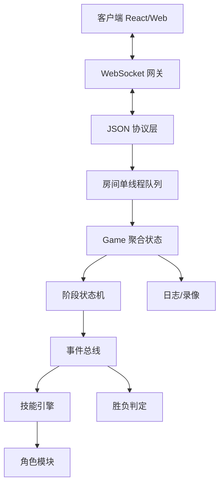

# 无间风云基础人物版 MVP

## 项目目标

基于已转换的《无间风云》规则文档 `outputs/7.2_converted.txt`，参考前面《风声》项目架构，逐步实现一个"先可玩、后扩展"的《无间风云》基础人物版。

核心路线：先做核心规则引擎，再做常规技能，再做 8-10 个基础人物，最后逐步扩展到 25 个基础人物。

## 推荐技术路线

MVP 优先采用：

- 前端：React + TypeScript
- 后端：Node.js + TypeScript + WebSocket
- 协议：JSON 起步，后续可迁移 Protobuf

长期正式版可评估：

- 前端：Cocos Creator 或 React
- 后端：Kotlin + Netty + Protobuf
- 房间模型：Actor/单房间串行队列

## 当前完成状态

### Milestone 1：核心规则可跑 ✅

4-8 人局；身份；真/假情报；传递/接收/拒收；试探/锁定/截获；濒死/死亡；红蓝胜利。

已完成：

- ✅ 整理 MVP 规则清单与范围边界
- ✅ 设计服务端核心领域模型
- ✅ 设计阶段 FSM 与事件队列
- ✅ 搭建 TypeScript WebSocket + React MVP 项目骨架
- ✅ 实现房间与身份分配原型
- ✅ 实现情报传递核心流程
- ✅ 实现试探、锁定、截获常规技能
- ✅ 实现濒死、死亡与红蓝胜利
- ✅ 实现最小 Web 对局界面
- ✅ 接入首批 10 个基础人物技能
- ✅ 多轮 UI 优化（牌桌布局、中文化日志、流程条、技能查看、桌面操作）
- ✅ 一键部署脚本（install/update/status）
- ✅ GM 强制推进阶段
- ✅ 规则引擎测试补强（64 测试）
- ✅ 白方机密任务系统设计

### Milestone 2：基础人物 10 个 ✅

已接入首批 10 个基础人物（角色图 + 技能 + MVP 简化实现）：

1. ✅ 001 陈永仁（城府 + 就计）
2. ✅ 002 刘建明（城府 + 灭迹）
3. ✅ 004 福尔摩斯（真相 + 揭露）
4. ✅ 006 成步堂龙一（异议 + 逆转）
5. ✅ 008 开膛手杰克（昭彰 + 惯犯）
6. ✅ 009 秋濑或（探究 + 赌博）
7. ✅ 014 绫里千寻（辩护 + 灵媒）
8. ✅ 016 C.C（契约 + 守护）
9. ✅ 017 绫波丽（冰山 + 克隆）
10. ✅ 020 我妻由乃（崩坏 + 新生）

### Milestone 3：白方机密任务

状态：⬜ 已设计，待实现

已完成白方任务系统设计文档：`outputs/white-mission-system-design.md`

待实现：

- 任务框架与条件检查器
- 为 10 个 MVP 角色定义简化版任务
- 扩展宣胜窗口接受白方宣胜
- 拦截型任务
- 死亡延迟宣胜
- 最终 PK 系统

### Milestone 4：基础人物补完到 25 个

状态：⬜ 未开始

逐步实现 001-025 中剩余中等复杂角色，暂缓替身、绝望、复杂死亡后技能等高复杂角色。

剩余待补角色：
- 003 夜神月、005 诸葛亮、007 御剑怜侍
- 010 约翰克莱默、011 秋山深一
- 015 弥海砂、021 神崎直
- 022 贝尔摩德、023 川岛芳子
- 024 魏忠贤、025 史密斯夫妇

暂缓：012 基德、013 狛枝凪斗、018 江之岛盾子、019 顾晓梦

### Milestone 5：线上可用性增强

状态：⬜ 大部分未开始

已做：
- ✅ 一键部署脚本 (deploy/)
- ✅ GM 强制推进阶段

待做：
- 录像/回放
- 完整 GM 管理面板
- 断线重连恢复
- 机器人玩家
- 错误恢复与状态回滚

## 核心架构

## 核心模型方向

- GameRoom：房间、玩家、阶段、事件队列、待响应动作
- Player：身份、角色、生死、情报、常规技能次数、状态、标记
- InfoCard：真/假情报、来源、当前归属、公开状态、标签
- GamePhase：选角、开局、技能阶段、传递、反应、濒死、死亡、胜利检查、回合结束
- GameEvent：传递声明、锁定、截获、接收、拒收、烧毁、试探、濒死、死亡、宣胜等
- Skill：触发点、可用条件、输入、效果

## 约束与原则

- 第一版不要实现全部 100 个角色。
- 第一版不要实现战功系统。
- 第一版减少私聊/法官口头判定，尽量改为明确 UI 操作。
- 技能不要写死在流程中，应通过事件系统和技能引擎挂接。
- 死亡优先于胜利必须作为全局结算原则。
- 白方不是统一阵营，任务必须按角色/玩家独立判定。

## 当前测试覆盖

- 3 个测试文件
- 64 个测试
- 覆盖：身份分配、角色分配、转移流程、锁定/截获优先级、濒死死亡、胜利系统、全 10 角色技能、5-8 人局、GM 推进、阶段边界

## 近期待办

1. 实现白方任务系统（基于设计文档）
2. 补完基础人物 11-25（第二批中等复杂角色）
3. 技能引擎重构（技能注册式挂接，减少 switch case）
4. 9-10 人局支持
5. 角色选择与开局选项
6. 断线重连
7. 录像/回放
8. 规则测试持续补强
