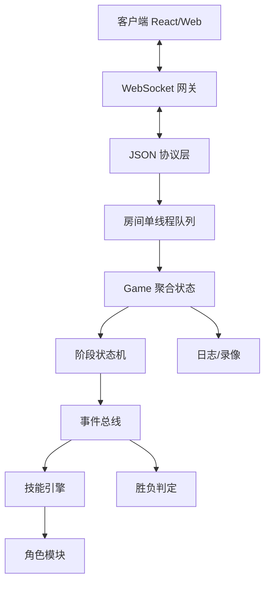

# 无间风云基础人物版 MVP

## 项目目标

基于已转换的《无间风云》规则文档 `D:/wujian/wujian/7.2_converted.txt`，参考前面《风声》项目架构，逐步实现一个“先可玩、后扩展”的《无间风云》基础人物版。

核心路线：先做核心规则引擎，再做常规技能，再做 8-10 个基础人物，最后逐步扩展到 25 个基础人物。

## 推荐技术路线

MVP 优先采用：

- 前端：React + TypeScript
- 后端：Node.js + TypeScript + WebSocket
- 协议：JSON 起步，后续可迁移 Protobuf

长期正式版可评估：

- 前端：Cocos Creator 或 React
- 后端：Kotlin + Netty + Protobuf
- 房间模型：Actor/单房间串行队列

## MVP 范围

### 房间系统

- 创建房间
- 加入房间
- 座位顺序
- 房主开始游戏
- 断线重连后置

### 身份系统

- 支持 4-8 人局起步
- 红/蓝/白身份分配
- 身份暗置
- 死亡后翻身份

### 情报系统

- 真情报 / 假情报
- 传递
- 接收 / 拒收
- 情报归属
- 情报公开结算

### 常规技能

- 试探
- 锁定
- 截获

### 生死与胜利

- 假情报达到上限进入濒死
- 濒死技能窗口
- 死亡结算
- 杀人奖励试探
- 红/蓝三真宣胜
- 红/蓝清场宣胜
- 白方任务预留
- 死亡优先于胜利
- 技能阶段前宣胜窗口

### 第一批基础人物

建议先实现 10 个：

1. 001 陈永仁
2. 002 刘建明
3. 004 福尔摩斯
4. 006 成步堂龙一
5. 008 开膛手杰克
6. 009 秋濑或
7. 014 绫里千寻
8. 016 C.C
9. 017 绫波丽
10. 020 我妻由乃

## 核心架构

## 核心模型方向

- GameRoom：房间、玩家、阶段、事件队列、待响应动作
- Player：身份、角色、生死、情报、常规技能次数、状态、标记
- InfoCard：真/假情报、来源、当前归属、公开状态、标签
- GamePhase：选角、开局、技能阶段、传递、反应、濒死、死亡、胜利检查、回合结束
- GameEvent：传递声明、锁定、截获、接收、拒收、烧毁、试探、濒死、死亡、宣胜等
- Skill：触发点、可用条件、输入、效果

## 阶段里程碑

### Milestone 1：核心规则可跑

状态：⬜ 进行中

4-6 人局；身份；真/假情报；传递/接收/拒收；试探/锁定/截获；濒死/死亡；红蓝胜利。

已完成：

- ✅ 整理 MVP 规则清单与范围边界：`outputs/mvp-rules-scope-ts-web.md`
- ✅ 设计服务端核心领域模型：`outputs/server_domain_model_design.md`
- ✅ 设计阶段 FSM 与事件队列：`outputs/fsm_event_queue_design.md`
- ✅ 搭建 TypeScript WebSocket + React MVP 项目骨架：`server/`、`client/`、`shared/`

### Milestone 2：基础人物 10 个

状态：⬜ 未开始

接入角色技能框架，实现首批 10 个基础人物。

### Milestone 3：白方机密任务

状态：⬜ 未开始

实现任务系统、任务触发事件、宣胜窗口、死亡后任务判定。

### Milestone 4：基础人物补完到 25 个

状态：⬜ 未开始

逐步实现 001-025 中剩余中等复杂角色，暂缓替身、绝望、复杂死亡后技能等高复杂角色。

### Milestone 5：线上可用性增强

状态：⬜ 未开始

录像/回放、GM 管理、断线重连、机器人、错误恢复。

## 约束与原则

- 第一版不要实现全部 100 个角色。
- 第一版不要实现战功系统。
- 第一版减少私聊/法官口头判定，尽量改为明确 UI 操作。
- 技能不要写死在流程中，应通过事件系统和技能引擎挂接。
- 死亡优先于胜利必须作为全局结算原则。
- 白方不是统一阵营，任务必须按角色/玩家独立判定。
